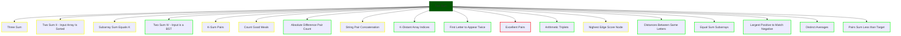

```mermaid
flowchart TD
classDef easy stroke-width:2px,stroke:#0f0
classDef medium stroke-width:2px,stroke:#ff0
classDef hard stroke-width:2px,stroke:#f00
classDef complete stroke-width:2px,stroke:#050,fill:#050

two_sum[Two Sum]:::complete
click two_sum https://leetcode.com/problems/two-sum/description
three_sum[Three Sum]:::medium
two_sum_ii[Two Sum II - Input Array Is Sorted]:::medium
subarray_sum_equals_k[Subarray Sum Equals K]:::medium
two_sum_iv[Two Sum IV - Input is a BST]:::easy
max_number_of_k_sum_pairs[K-Sum Pairs]:::medium
count_good_meals[Count Good Meals]:::medium
count_number_of_pairs_with_absolute_difference_k[Absolute Difference Pair Count]:::easy
number_of_pairs_of_strings_with_concatenation_equal_to_target[String Pair Concatenation]:::medium
find_all_k_distant_indices_in_an_array[K-Distant Array Indices]:::easy
first_letter_to_appear_twice[First Letter to Appear Twice]:::easy
number_of_excellent_pairs[Excellent Pairs]:::hard
number_of_arithmetic_triplets[Arithmetic Triplets]:::easy
node_with_highest_edge_score[Nighest Edge Score Node]:::medium
check_distances_between_same_letters[Distances Between Same Letters]:::easy
find_subarrays_with_equal_sum[Equal Sum Subarrays]:::easy
largest_positive_integer_that_exists_with_its_negative[Largest Positive to Match Negative]:::easy
number_of_distinct_averages[Distinct Averages]:::easy
count_pairs_whose_sum_is_less_than_target[Pairs Sum Less than Target]:::easy

two_sum --> three_sum
two_sum --> two_sum_ii
two_sum --> subarray_sum_equals_k
two_sum --> two_sum_iv
two_sum --> max_number_of_k_sum_pairs
two_sum --> count_good_meals
two_sum --> count_number_of_pairs_with_absolute_difference_k
two_sum --> number_of_pairs_of_strings_with_concatenation_equal_to_target
two_sum --> find_all_k_distant_indices_in_an_array
two_sum --> first_letter_to_appear_twice
two_sum --> number_of_excellent_pairs
two_sum --> number_of_arithmetic_triplets
two_sum --> node_with_highest_edge_score
two_sum --> check_distances_between_same_letters
two_sum --> find_subarrays_with_equal_sum
two_sum --> largest_positive_integer_that_exists_with_its_negative
two_sum --> number_of_distinct_averages
two_sum --> count_pairs_whose_sum_is_less_than_target
```
