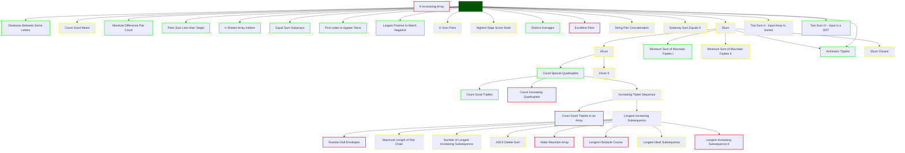

```mermaid
flowchart TD
classDef easy stroke-width:2px,stroke:#0f0
classDef medium stroke-width:2px,stroke:#ff0
classDef hard stroke-width:2px,stroke:#f00
classDef complete stroke-width:2px,stroke:#050,fill:#050

check_distances_between_same_letters[Distances Between Same Letters]:::easy
count_good_meals[Count Good Meals]:::medium
count_good_triplets[Count Good Triplets]:::easy
count_good_triplets_in_an_array[Count Good Triplets in an Array]:::hard
count_increasing_quadruplets[Count Increasing Quadruplets]:::hard
count_number_of_pairs_with_absolute_difference_k[Absolute Difference Pair Count]:::easy
count_pairs_whose_sum_is_less_than_target[Pairs Sum Less than Target]:::easy
count_special_quadruplets[Count Special Quadruplets]:::easy
find_all_k_distant_indices_in_an_array[K-Distant Array Indices]:::easy
find_subarrays_with_equal_sum[Equal Sum Subarrays]:::easy
find_the_longest_valid_obstacle_course_at_each_position[Longest Obstacle Course]:::hard 
first_letter_to_appear_twice[First Letter to Appear Twice]:::easy
four_sum[4Sum]:::medium
four_sum_ii[4Sum II]:::medium
increasing_triplet_subsequence[Increasing Triplet Sequence]:::medium
largest_positive_integer_that_exists_with_its_negative[Largest Positive to Match Negative]:::easy
longest_ideal_subsequence[Longest Ideal Subsequence]:::medium 
longest_increasing_subsequence[Longest Increasing Subsequence]:::medium
longest_increasing_subsequence_ii[Longest Increasing Subsequence II]:::hard
max_number_of_k_sum_pairs[K-Sum Pairs]:::medium
maximum_length_of_pair_chain[Maximum Length of Pair Chain]:::medium
minimum_ascii_delete_sum_for_two_strings[ASCII Delete Sum]:::medium
minimum_number_of_removals_to_make_mountain_array[Make Mountain Array]:::hard
minimum_operations_to_make_the_array_k_increasing[K-Increasing Array]:::hard
minimum_sum_of_mountain_triplets_i[Minimum Sum of Mountain Triplets I]:::easy
minimum_sum_of_mountain_triplets_ii[Minimum Sum of Mountain Triplets II]:::medium 
node_with_highest_edge_score[Nighest Edge Score Node]:::medium
number_of_arithmetic_triplets[Arithmetic Triplets]:::easy
number_of_distinct_averages[Distinct Averages]:::easy
number_of_excellent_pairs[Excellent Pairs]:::hard
number_of_longest_increasing_subsequence[Number of Longest Increasing Subsequence]:::medium
number_of_pairs_of_strings_with_concatenation_equal_to_target[String Pair Concatenation]:::medium
russian_doll_envelopes[Russian Doll Envelopes]:::hard
subarray_sum_equals_k[Subarray Sum Equals K]:::medium
three_sum[3Sum]:::medium
three_sum_closest[3Sum Closest]:::medium
two_sum[Two Sum]:::complete
two_sum_ii[Two Sum II - Input Array Is Sorted]:::medium
two_sum_iv[Two Sum IV - Input is a BST]:::easy


two_sum --> three_sum
two_sum --> two_sum_ii
two_sum --> subarray_sum_equals_k
two_sum --> two_sum_iv
two_sum --> max_number_of_k_sum_pairs
two_sum --> count_good_meals
two_sum --> count_number_of_pairs_with_absolute_difference_k
two_sum --> number_of_pairs_of_strings_with_concatenation_equal_to_target
two_sum --> find_all_k_distant_indices_in_an_array
two_sum --> first_letter_to_appear_twice
two_sum --> number_of_excellent_pairs
two_sum --> number_of_arithmetic_triplets
two_sum --> node_with_highest_edge_score
two_sum --> check_distances_between_same_letters
two_sum --> find_subarrays_with_equal_sum
two_sum --> largest_positive_integer_that_exists_with_its_negative
two_sum --> number_of_distinct_averages
two_sum --> count_pairs_whose_sum_is_less_than_target
three_sum --> three_sum_closest
three_sum --> four_sum
three_sum --> number_of_arithmetic_triplets
three_sum --> minimum_sum_of_mountain_triplets_i
three_sum --> minimum_sum_of_mountain_triplets_ii
four_sum --> four_sum_ii
four_sum --> count_special_quadruplets
count_special_quadruplets --> increasing_triplet_subsequence
count_special_quadruplets --> count_good_triplets
count_special_quadruplets --> count_increasing_quadruplets
increasing_triplet_subsequence --> longest_increasing_subsequence
increasing_triplet_subsequence --> count_good_triplets_in_an_array
longest_increasing_subsequence --> russian_doll_envelopes
longest_increasing_subsequence --> maximum_length_of_pair_chain
longest_increasing_subsequence --> number_of_longest_increasing_subsequence
longest_increasing_subsequence --> minimum_ascii_delete_sum_for_two_strings
longest_increasing_subsequence --> minimum_number_of_removals_to_make_mountain_array
longest_increasing_subsequence --> find_the_longest_valid_obstacle_course_at_each_position
longest_increasing_subsequence --> longest_ideal_subsequence
longest_increasing_subsequence --> longest_increasing_subsequence_ii
```
